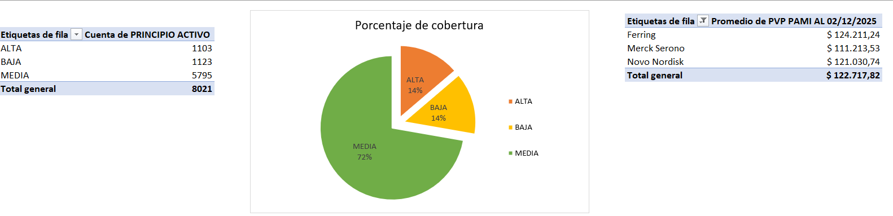
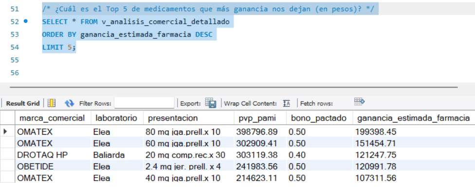

# 📊 Análisis de Rentabilidad y Catálogo Farmacéutico (PAMI 2025)

## 📌 Descripción del Proyecto
Este proyecto consiste en un análisis integral del catálogo de medicamentos con cobertura de PAMI. El objetivo principal fue transformar datos brutos en información estratégica para la toma de decisiones comerciales, identificando oportunidades de ahorro para el afiliado y márgenes de contribución para la entidad.

Como valor agregado, se diseñó un **modelo de rentabilidad externo** (no presente en el dataset original) para simular acuerdos comerciales con laboratorios y practicar lógica de negocio avanzada.

## 🛠️ Tecnologías y Habilidades
* **Excel**: Limpieza de datos (ETL), tratamiento de formatos numéricos/moneda y análisis exploratorio con Tablas Dinámicas.
* **SQL (MySQL)**: Creación de esquemas, normalización de datos, consultas de agregación, subconsultas y `JOINs` complejos.
* **Business Intelligence**: Segmentación de productos por niveles de cobertura y detección de productos "Top Performers".

## 📂 Estructura del Proyecto
* `data/`: Contiene el archivo original y la versión procesada.
* `sql_queries/`: Scripts para la creación de tablas, importación y análisis.
* `visualizations/`: Gráficos de tendencias y reportes.

## 📈 Hallazgos Clave (Insights)
1.  **Segmentación de Cobertura**: El **72%** de los medicamentos se encuentran en el rango de "Cobertura Media", lo que define el perfil de gasto del afiliado.
2.  **Optimización de Margen**: Mediante el uso de `LEFT JOIN`, se identificaron productos de alta complejidad (Laboratorio Elea, entre otros) que representan el mayor margen de contribución por unidad vendida.
3.  **Detección de Outliers**: Se detectaron medicamentos con precios significativamente superiores al promedio, críticos para la gestión de stock.

## 🔗 Fuentes de Datos
Los datos originales fueron extraídos del portal oficial de datos abiertos de PAMI:
[Medicamentos para Entidades - PAMI](https://datos.pami.org.ar/dataset/medicamentos-para-entidades)

---

## 🖼️ Visualizaciones del Proyecto

### Análisis de Cobertura (Excel)

### Consultas de Rentabilidad (SQL)

